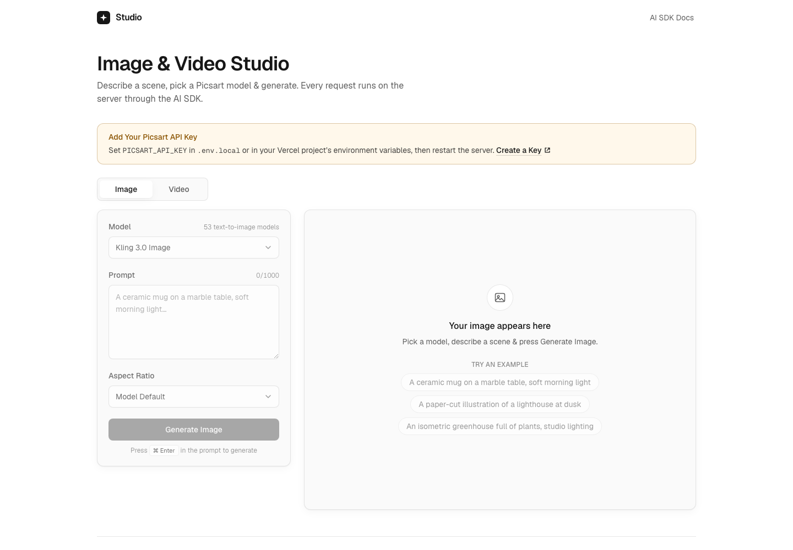

# Picsart Image & Video Studio

A Next.js starter that generates images and videos with Picsart models through the [Vercel AI SDK](https://ai-sdk.dev) and the `@picsart/vercel-ai-provider` [community provider](https://ai-sdk.dev/providers/community-providers).

[](https://vercel.com/new/clone?repository-url=https%3A%2F%2Fgithub.com%2FPicsArt%2Fpicsart-vercel-starter&env=PICSART_API_KEY&envDescription=Your%20Picsart%20API%20key%2C%20used%20on%20the%20server%20to%20generate%20images%20and%20videos&envLink=https://picsart.com/api-platform/docs/authentication)



## What it does

- **Image tab.** Pick a text-to-image model, write a prompt, choose an aspect ratio when the model offers one, and generate one image. The result shows the image, a link that opens the same model and settings in the Picsart AI Playground, and the credits the generation cost.
- **Video tab.** Pick a text-to-video model and start a video. The page checks the job every 5 seconds until it is done, then plays the video with its AI Playground link and credits. A running job survives a tab switch or a page reload.
- **Spend protection** for a public demo: one generation per request, per-IP rate limits, a kill switch, a separate video switch, the shortest video duration each model offers, model allowlists, and duplicate-submit protection. Every limit is an environment variable.
- **Light & dark themes** that follow the system setting, keyboard navigation, visible focus, loading skeletons, and empty and error states.

## How it works

Every Picsart call runs on the server, so `PICSART_API_KEY` never reaches the browser.

| Route | AI SDK call | What the browser gets |
|---|---|---|
| `POST /api/image` | `generateImage({ model: picsart.image(id), prompt, n: 1 })` | The image URL from `images[0].providerMetadata.picsart`, its `playgroundUrl`, and `credits` from `calls[i].providerMetadata.picsart` |
| `POST /api/video` | `experimental_startVideo({ model: picsart.video(id), prompt, n: 1 })` | A signed ticket that wraps the returned `operation`, plus the `playgroundUrl` |
| `POST /api/video/status` | `experimental_getVideoStatus(picsart.video(id), { operation })` | `pending`, `completed` with the video URL, `playgroundUrl` and `videos[0].credits`, or `error` with Picsart's message |

Models are never hardcoded. The page and the routes read them at request time from `picsart.listModels({ mode })` and `picsart.catalog`, then keep the models whose `inputType` is `t2i` or `t2v` and whose only required parameter is `prompt`. Aspect ratios come from each model's `aspectRatio` parameter in the catalog. The logic lives in [`lib/server/models.ts`](lib/server/models.ts).

A Picsart video takes minutes, longer than a serverless function should wait. The start route returns right away, and the browser polls the status route, which makes one status check per request. The provider README (in `node_modules/@picsart/vercel-ai-provider/README.md`) explains this pattern under "Long videos on serverless".

## Run locally

You need Node.js 22 or newer and a [Picsart API key](https://picsart.com/api-platform/docs/authentication).

```bash
npm install
cp .env.example .env.local   # then set PICSART_API_KEY in .env.local
npm run dev
```

Open http://localhost:3000. Without a key, the page loads, lists the models and explains how to add one; the routes answer `503` and nothing is sent to Picsart.

The provider comes from npm as [`@picsart/vercel-ai-provider`](https://www.npmjs.com/package/@picsart/vercel-ai-provider). The project `.npmrc` pins the `@picsart` scope to the public npm registry, so `npm install` gets it from there even when your npm config points `@picsart` at another registry.

## Environment variables

| Variable | Default | What it does |
|---|---|---|
| `PICSART_API_KEY` | none (required) | Picsart API key. Read on the server only. Without it the routes answer `503`. |
| `PICSART_DEMO_ENABLED` | `true` | Kill switch. `false` makes every route answer `503` with a friendly message, and the page says generation is paused. |
| `PICSART_DEMO_VIDEO_ENABLED` | `true` | `false` turns off video starts (`503`). Status checks for videos already started keep working, since they cost nothing. |
| `PICSART_DEMO_WINDOW_SECONDS` | `3600` | Length of the rate-limit window. |
| `PICSART_DEMO_IMAGE_LIMIT` | `10` | Images one IP can generate per window. |
| `PICSART_DEMO_VIDEO_LIMIT` | `2` | Videos one IP can start per window. |
| `PICSART_DEMO_STATUS_LIMIT` | `1000` | Video status checks one IP can make per window. The page checks every 5 seconds while a video runs. |
| `PICSART_DEMO_PROMPT_MAX_LENGTH` | `1000` | Longest prompt, in characters, after trimming. |
| `PICSART_DEMO_VIDEO_SHORTEST` | `true` | Ask each video model for the shortest duration its catalog entry allows. `false` uses the model's default duration. |
| `PICSART_DEMO_IMAGE_MODELS` | all | Comma-separated model IDs to offer on the Image tab, in that order. IDs that aren't prompt-only text-to-image models are ignored. |
| `PICSART_DEMO_VIDEO_MODELS` | all | The same for the Video tab and text-to-video models. |

Switches accept `true`, `false`, `1`, `0`, `on`, `off`, `yes` and `no`. Limits must be positive whole numbers; any other value falls back to the default. `.env.example` lists every variable.

## Spend protection

Anyone who can open a public deployment can spend its credits. These are on by default:

- **One item per request.** `n` is always `1`, and each video start makes one video.
- **Per-IP rate limits** for images, videos and status checks, answered with `429` and a `Retry-After` header. The client IP comes from `x-forwarded-for`, which Vercel sets. Behind another proxy, make sure that header can't be forged.
- **In-memory counters.** The limiter in [`lib/server/rate-limit.ts`](lib/server/rate-limit.ts) keeps its counts in the memory of one function instance. Vercel runs several instances under load and starts fresh ones after idle periods, so the real limit is higher than the configured one. For a dependable limit across instances, back `rateLimiter.hit` with a shared store such as Upstash Redis from the [Vercel Marketplace](https://vercel.com/marketplace) (for example `@upstash/ratelimit`).
- **Duplicate submits.** The page sends an `Idempotency-Key` with every generation, and a repeat of the same key within 10 minutes gets the first answer instead of a second paid job. This cache is per instance too.
- **Kill switch & video switch.** `PICSART_DEMO_ENABLED=false` stops everything; `PICSART_DEMO_VIDEO_ENABLED=false` stops video only. Environment changes take effect on the next deployment.
- **Short videos.** Videos use the shortest duration each model allows unless `PICSART_DEMO_VIDEO_SHORTEST=false`.
- **Model allowlists.** Offer only models whose cost you accept with `PICSART_DEMO_IMAGE_MODELS` and `PICSART_DEMO_VIDEO_MODELS`.
- **No retries of paid calls.** Generation and video starts run with `maxRetries: 0`.

Video costs more than images, and a price quote can understate what a video job ends up costing, so keep `PICSART_DEMO_VIDEO_LIMIT` low on a public deployment, keep only the balance you're ready to spend on the Picsart account, and watch its usage. The page never shows the account balance.

## Security

- `PICSART_API_KEY` is read only in server modules that import `server-only`. Routes never return it: error messages that come from Picsart are redacted and shortened, and unexpected errors get a generic message. The tests check the success and error responses of every route for the key.
- Every request body is validated: JSON only, at most 16 KB, a trimmed non-empty prompt under the length cap, a model ID from the filtered catalog list, and an aspect ratio that model offers.
- The video status route accepts only tickets issued by the start route. A ticket is the `operation` signed with HMAC-SHA256 under a key derived from `PICSART_API_KEY`; it expires after 6 hours. The route checks the signature, the operation's shape and the model, then the provider validates the operation again before it calls Picsart.
- API responses carry `Cache-Control: no-store`, and every response sends `X-Content-Type-Options`, `Referrer-Policy` and `X-Frame-Options` headers.

## Pick models

By default the tabs offer every prompt-only model in the catalog of the installed `@picsart/ai-sdk`, in catalog order, and the first one is preselected. To offer a short list, set the allowlist variables. To see the IDs, run this in the project folder; it needs no key and makes no network call:

```bash
node --input-type=module -e "
import { picsart } from '@picsart/vercel-ai-provider';
for (const [mode, inputType] of [['image', 't2i'], ['video', 't2v']]) {
  const models = await picsart.listModels({ mode });
  console.log(mode, models.filter((model) => model.inputType === inputType).map((model) => model.id).join(','));
}"
```

To choose models by other capabilities, read their parameters from `picsart.catalog` in [`lib/server/models.ts`](lib/server/models.ts). For example, `model.params.generateAudio?.kind === 'boolean'` finds video models that can add sound. New Picsart models arrive with `@picsart/ai-sdk` updates.

## Scripts

| Command | What it runs |
|---|---|
| `npm run dev` | Development server |
| `npm run build` | Production build |
| `npm run start` | Production server |
| `npm run lint` | ESLint with the Next.js rules |
| `npm run typecheck` | `tsc --noEmit` |
| `npm test` | Vitest route tests with a mocked provider. They make no network calls and need no key. |

## Project structure

```
app/
  page.tsx                  Server component: reads the catalog and the switches
  api/image/route.ts        generateImage
  api/video/route.ts        experimental_startVideo
  api/video/status/route.ts experimental_getVideoStatus
components/                 Client UI: tabs, form, output states
lib/server/                 Config, model filtering, rate limits, tickets, error mapping
test/                       Route tests with a mocked provider
```

## Deploying on Vercel

The image route allows up to 300 seconds (`maxDuration`), which slower image models can need. That is the Hobby plan's maximum with Fluid compute; lower it if your plan allows less.

## Learn more

- [AI SDK community providers](https://ai-sdk.dev/providers/community-providers)
- [AI SDK image generation](https://ai-sdk.dev/docs/ai-sdk-core/image-generation)
- [Picsart API authentication](https://picsart.com/api-platform/docs/authentication)

Powered by [Picsart](https://picsart.com).

## License

[MIT](LICENSE)
